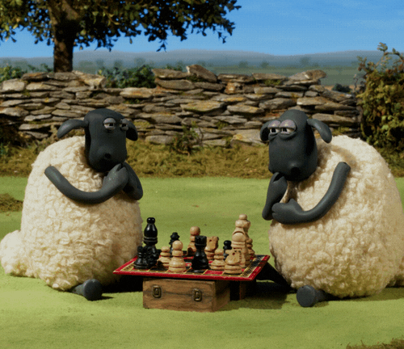
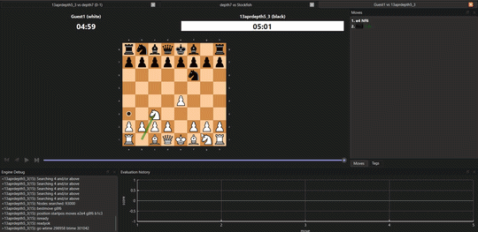

# Chess Engine

* As a part of my _**Design and Analysis of Algorithms**_ course mini project, I am working on this custom built chess engine in C++ using minimax algorithm with alpha-beta pruning.
* Starting off with terminal UI, I also added UCI support, making it compatible with GUI tools like CuteChess, Arena, etc.

---

<p align="center">
  
</p>


## Features

* Complete chess rules implementation

  * Legal move filtering
  * Check / checkmate detection
  * Castling
  * En passant
  * Pawn promotion

* Engine

  * Minimax search
  * Alpha-beta pruning
  * Basic move ordering (captures first)

---
<p align="center">
  
</p>

## How to Run

### Compile

```
g++ -std=c++17 -O2 main.cpp ai/engine.cpp board/Board.cpp display/printer.cpp input/input_handler.cpp moves/move_generator.cpp rules/rules.cpp eval/eval.cpp -o chess.exe
```

### Run
For terminal UI, uncomment the respective code in main.cpp and compile with above command. Then run:
```
./chess.exe
```
For CuteChess, compile with UCI code in main.cpp.
```
CuteChess --> Tools --> Settings --> Engines --> (+) --> Add the path to chess.exe
```

Best rating yet: Depth 7: 2000 estimated ELO
---

### Made by

me :) \
Shalaka :)

---


